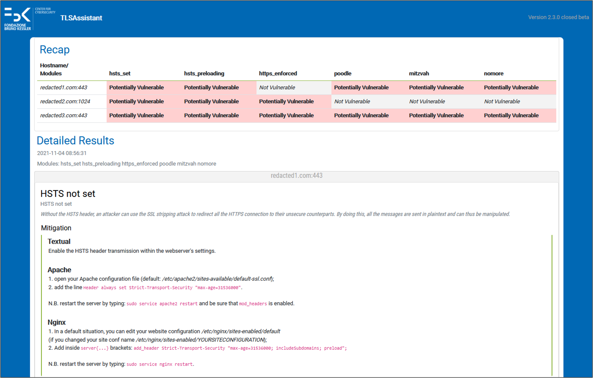

# TLSAssistant v3

**TLSAssistant v3.1** is the latest version of TLSAssistant, a modular state-of-the-art TLS analyzer, extensible with new features and thus capable of streamlining the mitigation process of known and newly discovered TLS attacks even for non-expert users. The companion page, containing additional details can be found [here](https://st.fbk.eu/tools/TLSAssistant/).

The latest release introduces a redesigned PDF report, a novel module able to perform compliance analyses against five agency-issued technical guidelines:
- **AgID** [ver.2020-01](https://cert-agid.gov.it/wp-content/uploads/2020/11/AgID-RACCSECTLS-01.pdf)
- **ANSSI** [v1.2](https://cyber.gouv.fr/sites/default/files/2017/07/anssi-guide-recommandations_de_securite_relatives_a_tls-v1.2.pdf)
- **BSI** [TR-02102-2](https://www.bsi.bund.de/SharedDocs/Downloads/EN/BSI/Publications/TechGuidelines/TG02102/BSI-TR-02102-2.html) and [TR-03116-4](https://www.bsi.bund.de/SharedDocs/Downloads/DE/BSI/Publikationen/TechnischeRichtlinien/TR03116/BSI-TR-03116-4.html)
- **Mozilla** [v5.7](https://wiki.mozilla.org/Security/Server_Side_TLS)
- **NIST** [SP 800-52 Rev. 2](https://nvlpubs.nist.gov/nistpubs/SpecialPublications/NIST.SP.800-52r2.pdf) (and related)

and the integration of a new state-of-the-art static and extensible app security testing tool called [SEBASTiAn](https://github.com/talos-security/SEBASTiAn). Its presence enhanced existing Android analyses and introduces the possiblity to analyze iOS applications.


## Features
<details>

<summary>Vulnerability analysis</summary>


*Vulnerability analysis report*

TLSAssistant is capable of identifying a wide range of TLS vulnerabilities and generating actionable reports that can assist the system administrators in correctly and easily fixing their configurations.

The list of detectable issues is:
- Android applications (.apk)
  - Accepting all SSL certificates
  - Allow all hostname
  - Certificate or keyStore disclosure
  - Crypto ECB ciphers
  - Debuggable application
  - Default HTTP scheme
  - Insecure connection
  - Insecure HostnameVerifier
  - Insecure SocketFactory
  - Insecure Socket
  - Invalid server certificate
  - Obfuscated Code
  - SSL GetInsecure Method
  - Weak Algorithms
  - WebView SSL Errors
- iOS applications (.ipa)
  - Allow HTTP Plist
  - Insecure connection Plist
  - Insecure TLS version Plist
  - No forward secrecy Plist
  - Weak crypto
- Webservers
  - 3SHAKE
  - ALPACA
  - BEAST
  - BREACH
  - CCS Injection
  - Certificate Transparency
  - CRIME
  - DROWN
  - FREAK
  - Heartbleed
  - HSTS preloading
  - HSTS set
  - HTTPS enforced
  - LOGJAM
  - LUCKY13
  - BAR MITZVAH
  - RC4 NOMORE
  - Padding oracle (SSL and TLS POODLE)
  - Perfect Forward Secrecy
  - RACCOON
  - SSL RENEGOTIATION
  - ROBOT
  - SLOTH
  - SWEET32
  - TICKETBLEED

</details>
<details>

<summary>Compliance analysis</summary>


*Compliance analysis report*

TLSAssistant is able to perform an automated compliance analysis against fivefive agency-issued technical guidelines:
- **AgID** [ver.2020-01](https://cert-agid.gov.it/wp-content/uploads/2020/11/AgID-RACCSECTLS-01.pdf)
- **ANSSI** [v1.2](https://cyber.gouv.fr/sites/default/files/2017/07/anssi-guide-recommandations_de_securite_relatives_a_tls-v1.2.pdf)
- **BSI** [TR-02102-2](https://www.bsi.bund.de/SharedDocs/Downloads/EN/BSI/Publications/TechGuidelines/TG02102/BSI-TR-02102-2.html) and [TR-03116-4](https://www.bsi.bund.de/SharedDocs/Downloads/DE/BSI/Publikationen/TechnischeRichtlinien/TR03116/BSI-TR-03116-4.html)
- **Mozilla** [v5.7](https://wiki.mozilla.org/Security/Server_Side_TLS)
- **NIST** [SP 800-52 Rev. 2](https://nvlpubs.nist.gov/nistpubs/SpecialPublications/NIST.SP.800-52r2.pdf) (and related)

It supports the following use-cases:
- **compare-to-one** - compare an already existing configuration against a single guideline. The output consists of a report that highlights the differences between the current and the target configuration and guides the system administrator towards closing the gap;
- **compare-to-many** - similar to the *compare-to-one* but considering multiple guidelines;
- **generate-after-one** - generate a working configuration compliant with a single guideline, taking into account any additional narrowing set by the user;
- **generate-after-many** - similar to the *generate-after-one* but considering multiple guidelines.

</details>

## Download

> [!TIP]
> We suggest to download the pre-built Docker provided by GitHub by fetching it with.
> ```bash
> docker pull ghcr.io/stfbk/tlsassistant:v3.1
> ```
> and running it with
> ```bash
> docker run --rm -v ${PWD}/results:/tlsassistant/results -t ghcr.io/stfbk/tlsassistant:v3.1 -s www.fbk.eu
> ```

However, if you want to install the dependencies on the system, you can use the following building methods:
### One Liner
To install the tool (in a virtual environment), execute the following command:
```bash
sudo apt update && sudo apt install git python3-dev python3-pip python3-venv -y && git clone https://github.com/stfbk/tlsassistant.git && cd tlsassistant && python3 -m venv venv && source venv/bin/activate && pip3 install -r requirements.txt && python3 install.py -v
```
---
### Step by Step
If you want to download and install by executing every step:
<details>

<summary>Show single steps</summary>

0. Install git
```bash
sudo apt update && sudo apt-get install git -y
```
1. Download the tool by running

```bash
git clone https://github.com/stfbk/tlsassistant.git && cd tlsassistant
```
2. Install python
  ```bash
  sudo apt update && sudo apt-get install python3-dev python3-pip python3-venv -y
  ```
3. Optional but recommended: Create a virtual environment
  ```bash
  python3 -m venv venv
  ```
  and activate the virtual environment
  ```bash
  source venv/bin/activate
  ```
4. Install the requirements
  ```bash
  pip3 install -r requirements.txt
  ```
5. Run the installer
  ```bash
  python3 install.py
  ```
</details>

---

### Docker

Recommended for non-Ubuntu users:

Since it does use APT and install dependencies, we can use the Dockerfile to build the image and contain the installation process.

<details>
<summary>Docker build and run tutorial</summary>

clone the repository:

```bash
  git clone https://github.com/stfbk/tlsassistant.git && cd tlsassistant
```
Build the docker image:
```bash
  docker build -t tlsassistant .
```
Run the docker image:

```bash
docker run --rm -v ${PWD}/results:/tlsassistant/results -t tlsassistant -s www.fbk.eu
```
add all the `args` that we want to pass after the `tlsassistant` keyword.


We can use the `-v` flag to mount directories with the TLS configuration files.

```bash
docker run --rm -v ${PWD}/results:/tlsassistant/results -v ${PWD}/configurations_to_mount:/tlsassistant/config_mounted -t tlsassistant -f config_mounted/apache.conf
```
</details>

## Usage
```bash
python3 run.py -h
```
<details>

<summary>Show raw output</summary>

```
usage: TLSAssistant [-h] [--version] [-v] [--openssl OPENSSL | --ignore-openssl] [-ot {pdf,html}] [-o OUTPUT] [--group-by {host,module}] (-s SERVER | -f FILE | -d DOMAIN_FILE | -l [LIST] | -a APK) [--apply-fix [APPLY_FIX]]
                    [-c CONFIGURATION | -m CONFIGURATION [CONFIGURATION ...]] [-e EXCLUDE [EXCLUDE ...]] [--stix] [--webhook [WEBHOOK]] [--prometheus [PROMETHEUS]] [--config_type {apache,nginx,auto}] [--guidelines COMPLIANCE_ARGS]
                    [--apache] [--security COMPLIANCE_ARGS] [--output_config COMPLIANCE_ARGS] [--certificate_index COMPLIANCE_ARGS] [--custom_guidelines COMPLIANCE_ARGS] [--use_cache] [--clean] [--no_psk]

TLSAssistant Help

optional arguments:
  -h, --help            show this help message and exit
  --version             show program's version number and exit
  -v, --verbosity       increase output verbosity
  --openssl OPENSSL, --openssl-version OPENSSL
                        Add openSSL version to consider if configuration analysis is asked.
  --ignore-openssl      During configuration analysis, ignore openssl version completely.
  -ot {pdf,html}, --output-type {pdf,html}
                        The type of the report output.
                        Output type can be omitted and can be obtained by --output extension.
  -o OUTPUT, --output OUTPUT
                        Set report path.
  --group-by {host,module}
                        Choose how to group results by.
  -s SERVER, --server SERVER
                        The hostname, target of the analysis.
  -f FILE, --file FILE  The configuration to analyze.
  -d DOMAIN_FILE, --domain_file DOMAIN_FILE
                        The file path which has the hostname to analyze.
  -l [LIST], --list [LIST]
                        List all modules or print an help of a module.
                        For Example
                        -l freak
  -a APP, --app APP     The apk/ipa path, target of the analysis.
  --apply-fix [APPLY_FIX]
                        Apply fix in the current configuration.
                         Give a path if using -s.
                        i.e.
                          python3 run.py -s fbk.eu --apply-fix myconf.conf
  -c CONFIGURATION, --conf CONFIGURATION, --configuration CONFIGURATION
                        Configuration path.
  -m CONFIGURATION [CONFIGURATION ...], --modules CONFIGURATION [CONFIGURATION ...]
                        List of modules to run
                        For example
                          -m breach crime freak
  -e EXCLUDE [EXCLUDE ...], --exclude EXCLUDE [EXCLUDE ...]
                        List of modules to exclude
                        For example
                          -e breach crime
  --stix                Generate STIX2 compliant output.
  --webhook [WEBHOOK]   Add a webhook url to send the results.
  --prometheus [PROMETHEUS]
                        Generate the prometheus output in a default path or in the specified path.
  --config_type {apache,nginx,auto}
                        Define the type of configuration to analyze.
  --guidelines COMPLIANCE_ARGS
                        A string containing the names of the guidelines that should be checked in the form: guideline_version1_version2 in the case of multiple guidelines they should be comma separated. Use "list" for a list of valid strings and "aliases" for a list of aliases.
  --apache              Default to False. If True the output configuration will have apache syntax, if false nginx will be used.
  --security COMPLIANCE_ARGS
                        Default to True. If False the legacy level priority will be used
  --output_config COMPLIANCE_ARGS
                        Where to save the output configuration file, only needed for generate one/many
  --certificate_index COMPLIANCE_ARGS
                        The index of the certificate to use for the analysis, only needed if the website has multiple certificates.Default to 1  (first certificate).
  --custom_guidelines COMPLIANCE_ARGS
                        A path to a custom guideline file, only needed if the user wants to use a custom guideline.
  --use_cache           Default to False. If True the program will use the cached testssl analysis, if False the cache will be ignored.
  --clean               Default to False. If True the program will remove the cached testssl analysis for this host.
  --no_psk              Default to False. If True the program will not consider PSK ciphersuites during analysis.

```
</details>

### Examples 
<details>
<summary>Show advanced examples</summary>

- Perform a **server** analysis

```bash
python3 run.py -s fbk.eu
```
<sub>If no configuration or module list provided, `default_server.json` is loaded.</sub>

- Perform a **configuration file** analysis

Here we specify the openssl version of the system which runs the web server.
```bash
python3 run.py -f my_apache_conf.conf --openssl 1.1.1
```

We can also **ignore the openssl version**, assuming the weakest version:
```bash
python3 run.py -f my_apache_conf.conf --ignore-openssl
```

- Perform a **TLS configuration file** analysis and **apply fixes**

By default, the configuration analyzed is changed in place.
```bash
python3 run.py -f my_apache_conf.conf --apply-fix
```

We can specify an **output** path of the fixed configuration:

```bash
python3 run.py -f my_apache_conf.conf --apply-fix my_output_conf.conf
```
- Perform an analysis by **selecting modules**

```bash
python3 run.py -s fbk.eu -m breach crime freak poodle hsts_preloading
```

Or by selecting a **TLSAssistant configuration file**:

```bash
python3 run.py -s fbk.eu -c default_server.json 
```

We can also **exclude some modules** without editing the configuration file:

```bash
python3 run.py -s fbk.eu -c default_server.json -e hsts_preloading
```

get the **full module list** with:
```bash
python3 run.py -l
```

- Perform an analysis with **subdomain enumeration**

```bash
python3 run.py -s *.fbk.eu
```

- Perform an analysis on a **.apk/.ipa file**

```bash
python3 run.py -a my_app[.apk/.ipa]
```

<sub>If no configuration or module list provided, `default_android.json` is loaded.</sub>

- Analyze **all domains in a file** (one per line, including subdomains enumeration)

Assuming the file `domains_list.log` looks like this:
```
music.amazon.it
facebook.com
*.fbk.eu
```
we execute:

```bash
python3 run.py -d domains_list.log
```

- Check the **compliance** of an existing deployment against AgID TLS guidelines

```bash
python3 run.py -m compare_one --guidelines agid -s www.example.com --ignore-openssl
```

- Generate a new configuration, already **compliant** with NIST guidelines

```bash
python3 run.py -m generate_one --guidelines nist --output_conf compliant_config.conf --openssl-version 3.0.2 -s placeholder
```

</details>


### Avaliable analysis modules

<details>
<summary>Show modules list</summary>

```bash
python3 run.py -l
```

Results:

```
Here's a list of all the modules available:
Android:
        accepting_all_certificates
        allow_all_hostname
        certificate_keystore_disclosure
        crypto_ecb_cipher
        debuggable_application
        default_scheme_http
        insecure_connection
        insecure_hostname_verifier
        insecure_socket_factory
        insecure_socket
        invalid_server_certificate
        obfuscated_code
        ssl_getinsecure_method
        weak_algorithms
        webview_ssl_errors
Compliance:
        compare_one
        compare_many
        generate_one
        generate_many
iOS:
        allow_http_plist
        allow_connection_plist
        allow_tls_version_plist
        no_forward_secrecy_plist
        weak_crypto
Server:
        3shake
        alpaca
        beast
        breach
        ccs_injection
        certificate_transparency
        crime
        drown
        freak
        heartbleed
        hsts_preloading
        hsts_set
        https_enforced
        logjam
        lucky13
        mitzvah
        nomore
        padding_oracle
        pfs
        sslpoodle
        tlspoodle
        raccoon
        renegotiation
        robot
        sloth
        sweet32
        ticketbleed
Use 
        -l module_name
 to read the details.
```

</details>

---

## Analysis types
The various types of analysis that can (currently) be performed are:

### Single Host
Since most of the vulnerabilities analyzed by the tool are covered by testssl.sh tool, we decided to make the analysis more efficient by performing a pre-analysis to populate a cache with its result. These will be used by the corresponding testssl.sh modules such as POODLE (an attack that exploits the availability of SSLv3 to downgrade the strength of the connection), during current and future analysis. Thus, in Step 3a the arguments of each individual module related to testssl.sh are obtained. These arguments will be provided to the method in order to perform the testssl.sh pre-analysis and populate the cache with the results. Once this is done, the individual modules are executed (Step 3b) and mitigations added if vulnerable.

### Single APK
Each Android-related module, such as Unsecure TrustManager (which evaluates if a custom implementation may be exploited to break certificate validation), runs the analysis (Step 3b) on the provided APK.

### Multiple Hosts
We perform a Single Host analysis on each one of the domains specified in an input list. Each result is concatenated and provided to the Output module as a single output.	

### TLS Configuration and Fixes
If a configuration file is provided, a WhiteBox analysis is performed by loading the TLS configuration into memory and performing a complete check of all available modules (Step 3b). Otherwise, if a configuration file is provided along with a valid hostname, a singlehost analysis is performed and then the fixes are integrated in the provided TLS configuration. We refer to this analysis as Hybrid: we perform a BlackBox analysis on the hostname and then we apply the fixes on the configuration file.

## How to contribute
Please refer to the related [Wiki](https://github.com/stfbk/tlsassistant/wiki) page.

## External/related projects

- Employed in the context of the industrial collaboration with [IPZS](https://www.ipzs.it)/F&C

- Integrated in the Horizon 2020 [FINSEC project](https://www.finsec-project.eu/)

- Listed as [software of interest](https://developers.italia.it/it/software/stfbk-tlsassistant-e1ccc0) for the Italian Public Administrations


## License

```
Copyright 2019, Fondazione Bruno Kessler

Licensed under the Apache License, Version 2.0 (the "License");
you may not use this file except in compliance with the License.
You may obtain a copy of the License at

    http://www.apache.org/licenses/LICENSE-2.0

Unless required by applicable law or agreed to in writing, software
distributed under the License is distributed on an "AS IS" BASIS,
WITHOUT WARRANTIES OR CONDITIONS OF ANY KIND, either express or implied.
See the License for the specific language governing permissions and
limitations under the License.
```

Developed within the [Security & Trust](https://st.fbk.eu/) research unit, part of the [Center for Cybersecurity](https://cs.fbk.eu/)  at [Fondazione Bruno Kessler](https://www.fbk.eu/en/) (Italy)

