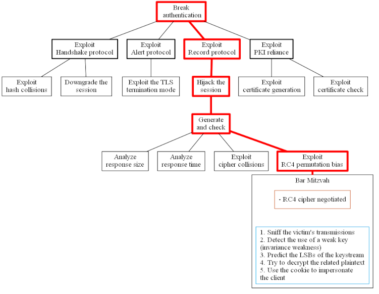
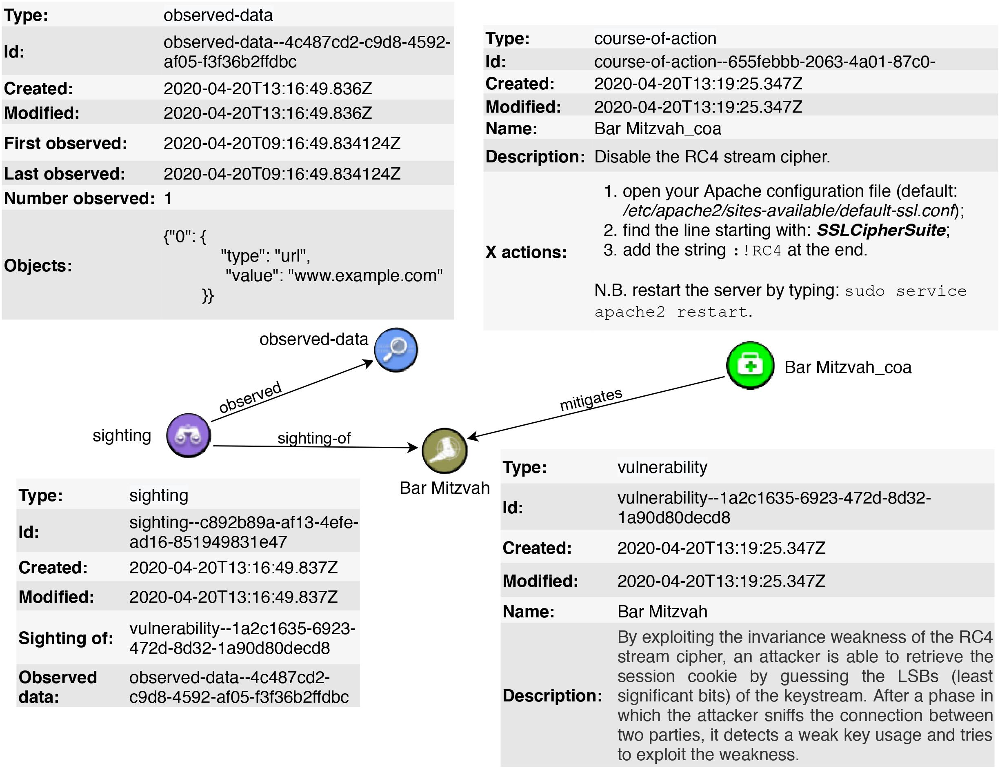

# TLSAssistant

**TLSAssistant** is a fully-featured tool that combines state-of-the-art TLS analyzers with a report system that suggests appropriate mitigations and shows the full set of viable attacks. The companion page can be found [here](https://stfbk.github.io/tools/TLSAssistant).

⚠`Disclaimer`⚠ TLSAssistant's v1.\* branch is currently on *maintenance mode*. It is stable but it will only receive hotfixes as the project is being rewritten from scratch to enrich and upgrade its capabilities. TLSAssistant's v2 will be released by the end of 2021.

## Features

### Mitigations
Thanks to the integrated analyzers, TLSAssistant is currently able to detect the following set of vulnerabilities: 
  - [3SHAKE](https://mitls.org/pages/attacks/3SHAKE)
  - [Bar Mitzvah](https://www.imperva.com/docs/HII_Attacking_SSL_when_using_RC4.pdf)
  - [BREACH](http://breachattack.com)
  - [Client-Initiated Renegotiation DoS](https://cve.mitre.org/cgi-bin/cvename.cgi?name=CVE-2011-1473)
  - [CRIME](https://docs.google.com/presentation/d/11eBmGiHbYcHR9gL5nDyZChu_-lCa2GizeuOfaLU2HOU/edit#slide=id.g1d134dff_1_222)
  - [DROWN](https://drownattack.com)
  - [HSTS not preloaded](https://hstspreload.org)
  - [HSTS not set](https://tools.ietf.org/html/rfc6797)
  - [HTTPS not enforced](https://tools.ietf.org/html/rfc6797#section-7.2)
  - [Lucky13](http://www.isg.rhul.ac.uk/tls/Lucky13.html)
  - [Missing Certificate Transparency](http://www.certificate-transparency.org)
  - [POODLE](https://www.openssl.org/~bodo/ssl-poodle.pdf)
  - [RC4NOMORE](https://www.rc4nomore.com)
  - [ROBOT](https://robotattack.org)
  - [SLOTH](https://www.mitls.org/pages/attacks/SLOTH)
  - [Sweet32](https://sweet32.info)
  - [Unsecure Android TrustManagers](https://dl.acm.org/citation.cfm?id=2382205)
  - [Weak Algorithms](https://developer.mozilla.org/en-US/docs/Web/Security/Weak_Signature_Algorithm)
  - Certificate or KeyStore Disclosure
  - WebViews Ignoring SSL Errors
  - Accepting ALL SSL Certificates

For each one of them, TLSAssistant is able to suggest an appropriate mitigation to easily fix the misconfiguration. These mitigations have been collected by fetching information from both scientific literature and each vendor's technical documentation.

### Attack trees
TLSAssistant is able to graphically represent the analysis result using a set of custom [attack trees](https://www.schneier.com/academic/archives/1999/12/attack_trees.html). Each tree consists of:
- **A goal (root).** indicating which security property would be broken;
- **Protocol/infrastructure subgoals.** displaying which protocol or infrastructure can be exploited in order to achieve the root goal;
- **Technique subgoals.** showing the technique an attacker has to use in order
to exploit the aforementioned protocol;
- **Attacks (leaves).** is divided into boxes. The first one lists the
prerequisites an attacker needs, the second one describes the steps needed to
exploit the vulnerability and, if needed, a third one shows how the attack is
concluded.

The following image shows a simplified version of the output


### STIX output
TLSAssistant is able to export the analysis result in [STIX](https://oasis-open.github.io/cti-documentation/stix/intro), a language used to share cyber threat intelligence (CTI) that can be represented with objects and their descriptive relationships. 
After every scan and for each discovered vulnerability, TLSAssistant generates a STIX bundle (JSON file) containing the following objects:
1. vulnerability;
2. course of action;
3. relationship;
4. observed data;
5. sighting.

The following image shows an example for the Bar Mitzvah attack


## Dependencies

To be able to run TLSAssistant you will need a set of dependencies that can be automatically downloaded by running `INSTALL.sh`.

It will download (and place in the correct folders) the following:

- packages: `aha`, `androguard`, `curl`, `git`, `graphviz`, `html2text`, `libxml2-utils`, `python3`, `wget`, `aria2c`, `openjdk`;
- analyzers: `mallodroid`, `testssl.sh`, `tlsfuzzer`, `SUPERAnalyzer`.

**Note**: TLSAssistant is not compatible with **W**indows **S**ubsystem for **L**inux v1.

## Download

You can install TLSAssistant by cloning this git repository:

```bash
git clone https://github.com/stfbk/tlsassistant.git
```

and running the `INSTALL.sh` script to install all the dependencies.


## Usage

Once in the right directory, run 
```bash
bash TLSAssistant.sh <parameters>
```

where

### Parameters

- `-h|--help` show the help
- `-s|--server [URL|IP] {port}` analyze a server, default port: *443*
- `-d|--domain <URL>` analyze the subdomains of a given website
- `-l|--list <file>` analyze the provided hosts list (one per line) 
- `-a|--apk <file>` check an apk installer
- `-x|--stix` STIX output format
- `-v [0|1|2|3]` verbosity level

### Verbosity level

- 0: mitigations' description
- 1: previous + code snippets [default]
- 2: previous + tools' individual reports
- 3: previous + highlighted attack trees

example: `bash TLSAssistant.sh -s github.com`

## Credits

TLSAssistant exists thanks to the following open-source projects (from a to z):

- [Androguard](https://github.com/androguard/androguard)
- [ctfr](https://github.com/UnaPibaGeek/ctfr)
- [mallodroid](https://github.com/stfbk/mallodroid)
- [markdown.bash](https://github.com/chadbraunduin/markdown.bash)
- [python-stix2](https://github.com/oasis-open/cti-python-stix2)
- [SUPERAnalyzer](https://github.com/SUPERAndroidAnalyzer/super)
- [testssl.sh](https://github.com/drwetter/testssl.sh)
- [tlsfuzzer](https://github.com/tomato42/tlsfuzzer)

## License
Copyright 2019-2021, Fondazione Bruno Kessler

Licensed under the Apache License, Version 2.0 (the "License");
you may not use this file except in compliance with the License.
You may obtain a copy of the License at

    http://www.apache.org/licenses/LICENSE-2.0

Unless required by applicable law or agreed to in writing, software
distributed under the License is distributed on an "AS IS" BASIS,
WITHOUT WARRANTIES OR CONDITIONS OF ANY KIND, either express or implied.
See the License for the specific language governing permissions and
limitations under the License.

Developed within [Security & Trust](https://stfbk.github.io/) Research Unit at [Fondazione Bruno Kessler](https://www.fbk.eu/en/) (Italy)
